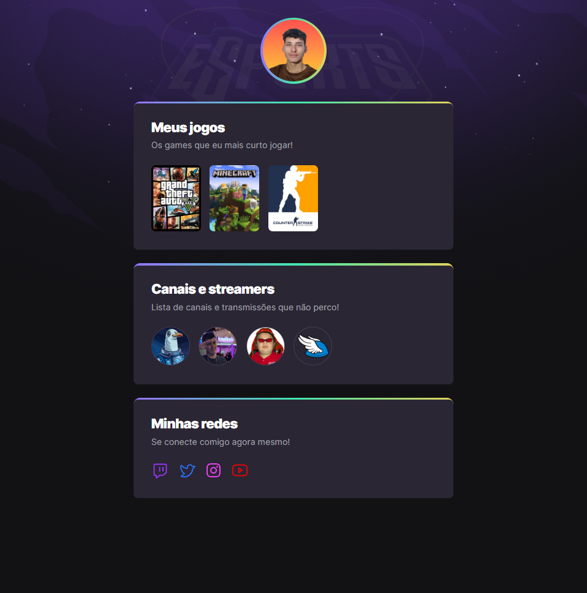

# NLW eSports

> Trilha Explorer

Projeto desenvolvido junto a RocketSeat no evento Next Level Week

[Accesse clicando aqui](https://caiogvm.github.io/nlw-esports-explorer)

##  🛠 Tecnologias
- HTML
- CSS
- Git e GitHub

## 📘 O que aprendi
- Como criar animações CSS a partir de @keyframes e aplicá-la aos elementos.

## 💚 Contatos
caiovalim12@gmail.com

[LinkedIn](https://www.linkedin.com/in/caiovalim/)